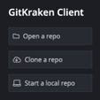

Requirements
- [Node and NPM](https://nodejs.org/)
- [Docker](https://www.docker.com/)

Step 1: Clone the Project

I strongly recommend using a git client called [GitKraken](https://www.gitkraken.com/), unlock the premium edition for free by using the [student pack](https://www.gitkraken.com/github-student-developer-pack-bundle)

Once installed, sign in to your GitHub account and then click on the “Clone a repo” button.

